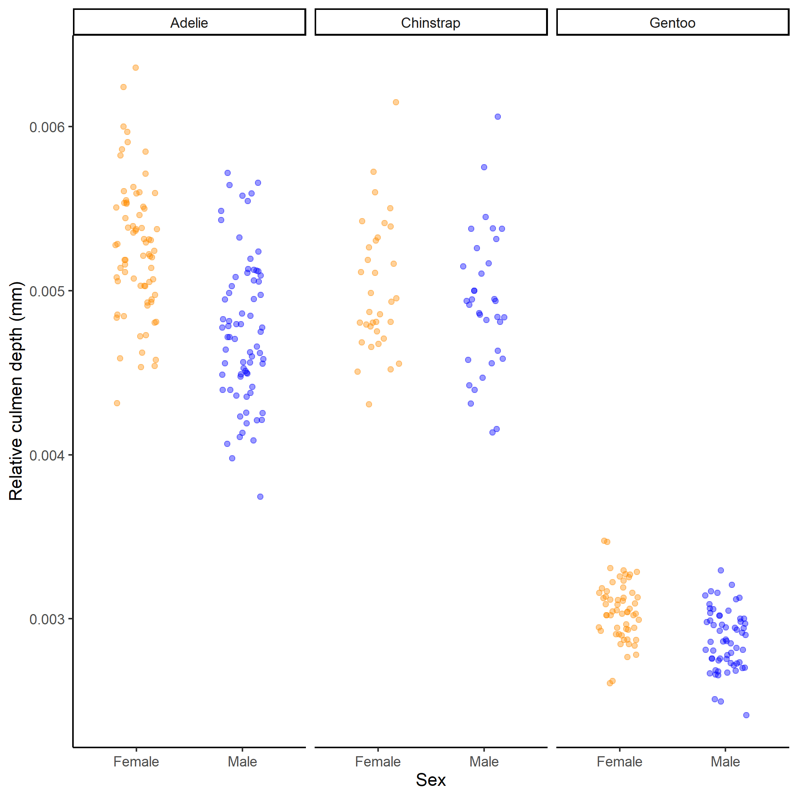

# Workflow Part Two - Week Three

```{r , echo=FALSE, eval=TRUE, include=TRUE}
klippy::klippy(c('r', 'bash'), position = c('top', 'right'), tooltip_message = 'copy to clipboard', tooltip_success = 'Copied!')
```

```{r include=FALSE}
knitr::opts_chunk$set(eval=FALSE)
```

Last week we worked through the journey of importing and tidying data to produce a clean dataset. 

It's important to remember what questions you have about the data collected, and to make an outline about what you want to do. 

```{block, type="rmdquestion"}
Now is a good time to think about what figures might we want to produce from our data?

We are mostly interested in observable 'differences' between our three penguin species. What sort of figures might illustrate that?

Sometimes it's good to get a pen/pencil and paper - and sketch the figure you might want to make. 
```

## Initial insights

Let's start with some basic insights, perhaps by focusing on further questions about specific variables. 

* How many penguins were observed?

* How many Adelie, Gentoo and Chinstrap penguins

* What is the distribution of morphologies such as bill length, body size, flipper length


Some of these are very simple in that they are summaries of single variables. Some are more complex, like evaluating the numbers of males and females which are the two groups in the sex variable. 

These are 'safety-checking' insights. You might already know the answers to some of these questions because you may have been responsible for collecting the data. Checking your answers against what you expect is a good way to check your data has been cleaned properly. 

## Numbers and sex of the penguins

```{r}
# how many observations of penguins were made

penguins %>% 
  summarise(n())

# but there are multiple observations of penguins across different years
# n_distinct deals with this

penguins %>% 
  summarise(n_distinct(individual_id))
```

The answer we get is that there are 190 different penguins observed across our multi-year study. 

This answer is provided in a tibble, but the variable name is an ugly composition of the functions applied, but we can modify the code

```{r}

penguins %>% 
  summarise(num_penguin_id=n_distinct(individual_id))
```

How about the number of penguins observed from each species?

```{r}
penguins %>% 
  group_by(species) %>% # ask for distinct counts in each species
  summarise(num_penguin_id=n_distinct(individual_id))
  
```

By adding the `group_by` function we tell R to apply any subsequent functions separately according to the group specified. Let's do this again for male and female penguins

```{r}
penguins %>% 
  group_by(sex) %>% # ask for distinct counts in each species
  summarise(num_penguin_id=n_distinct(individual_id))
  
```

Now what about the number of female Gentoo penguins?

```{r}
penguins %>% 
  group_by(sex, species) %>% # ask for distinct counts in each species
  summarise(num_penguin_id=n_distinct(individual_id))
```

Now we have a table that shows each combination of penguin species by sex, we can see for example that 65 unique Male Adelie penguins were observed in our study. We can also see that for 6 Adelie and 5 Gentoo penguins, sex was not recorded. 

> **Note - You have just had a crash course in using the `pipe` and `dplyr` to produce quick data summaries. Have a go at making some other summaries of your data, perhaps the numbers of penguins by island or region. Try some combinations. 

### Making a simple figure

Let's translate some of our simple summaries into graphs.

```{r}
# make summary data and assign to an object with a sensible name we can use
penguin_species_sex <- penguins %>% 
  group_by(sex, species) %>% # ask for distinct counts in each species
  summarise(num_penguin_id=n_distinct(individual_id)) %>% 
  drop_na() # remove the missing data

```

```{r}
# basic ggplot function to make a stacked barplot
penguin_species_sex %>% 
  ggplot(aes(x=species, 
             y=num_penguin_id, 
             fill=sex))+
  geom_col()
```

```{r, eval=TRUE, echo=FALSE, out.width="80%", fig.cap= "A first insight the number of male and female penguins of each species in our study"}
knitr::include_graphics("images/stacked_bar.png")
```

We will cover how ggplot works in more detail next week. But in brief, to get the graph we first use the `ggplot` function, we give `ggplot` the 'aesthetic mappings' of the plot, the values we wish to assign to the x axis, y axis and how we want to "fill in" the objects we will draw.

This first line of code will just draw a blank plot, with the *plus* + sign we signify that we want to add a new layer, this builds on top of the first layer and by specifying the function `geom_col` we request columns are layered onto the plot. This layer inherits all of the specifications of x,y and fill from `ggplot()`. And it produces a handy legend. 

### Challenge

```{block, type="rmdquestion"}
Can you write and run a script, with appropriate comments, that produces a summary tibble and graph for the number of penguins of each species, on the three study islands?
```

## Distributions

We now know how many penguins were surveyed. Let's move on to look at some distributions. One of our interests was the size of bill lengths, so let's look at the distribution of values in this variable. 

Looking at frequency distributions is very *useful* because it shows the shape of the *sample distribution*, that shape is very important for the types of formal statistics we can do later. 

Here is the script to plot frequency distribution, as before we pipe the data into ggplot. This time we only specify an x variable because we intend to plot a histogram and the y variable is always the count of observations. We then ask for the data to be presented in 50 equally sized bins of data. So in this case we have chopped the range of the x axis into 50 equal parts and counted the number of observations that fall within each one.

```{r}
penguins %>% 
  ggplot(aes(x=culmen_length_mm))+
  geom_histogram(bins=50)
```

```{r, eval=TRUE, echo=FALSE, out.width="80%", fig.cap= "Frequency distribution of culmen length in penguins"}

knitr::include_graphics("images/Distribution.png")

```
> ** Note - Bins. Have a go at changing the value specified to the bins argument, and observe how the figure changes.

### Insights

```{block, type="rmdquestion"}
* Are you surprised at all by the distribution? We have drawn a continuous variable from a natural population, what did you expect the distribution to look like?

* Can you change the code for the histogram plot to produce distributions for each sex? 

* How has this changed your interpretation of the distributions?
```


## More distributions

From the figures you have made, you should be able to make some guesses about the means and medians of the data. But we can use `dplyr` to get more accurate answers.

```{r}
# generate the mean, median and standard deviation of culmen length in three species of penguins

penguins %>% 
  group_by(species) %>% 
  summarise(mean_culmen_length=mean(culmen_length_mm),
            median_culmen_length=median(culmen_length_mm),
            sd_culmen_length=sd(culmen_length_mm))

```

Huh??? What's going on??? We get NAs because there are NAs in our dataset any calculation involving nothing produces nothing. Try this

```{r}
# messing about with NA calculations
4+NA

3*NA

NA^2

(1+2+NA)/2

```


We need to remember to specify the argument to remove `NA`

```{r}
# generate the mean, median and standard deviation of culmen length in three species of penguins
# specify the removal of NA values
penguins %>% 
  group_by(species)
  summarise(mean_culmen_length=mean(culmen_length_mm, na.rm=TRUE),
            median_culmen_length=median(culmen_length_mm, na.rm=TRUE),
            sd_culmen_length=sd(culmen_length_mm, na.rm=TRUE))

```
> The mean and median values for each species are *very* similar, which indicates we do not have much *skew* in our data. This detail is important because statistical analyses make lots of assumptions about the underlying distributions of the data.

### Initial conclusions

In these data we are already able to make some useful insights

* Fewer Chinstrap penguins were surveyed than Adelie or Gentoo's

* The average bill length for Adelie penguins is 38.8 mm, on average 8.7mm shorter than Gentoo's and 10mm shorter than Chinstrap's

* There does not appear to be much difference between Chinstrap and Gentoo bill lengths (on average 1.3mm)

These might appear to be modest insights - but have learned several data manipulation and summary techniques. We can also start to take a look at some of our initial hypotheses!!!

```{block, type="rmdquestion"}
* How does this data stack up against the hypothesis about bill morphology we put forward last week?
```

To make more and conclusive insights we have a bit further to go, but I think you deserve a pat on the back

```{r}
# R generate some praise
praise::praise()
```

## Data transformation

In the previous section we made some basic insights into observation numbers, distributed by species, sex and location. We also started to gain core insights into some of our central hypotheses, but you have probably noticed we don't actually have a variable on the `relative bill lengths/depths`. Why is this important? Well we clearly saw there was a difference in bill lengths between our three species. But we haven't taken into account that some of these species might be very different in body size. Our measure of bill lengths as an indicator of feeding strategy, might be confounded by body size (a bigger penguin is likely to have a bigger bill). 

We don't have a variable explicitly called body size. Instead we have to use "proxies" suitable proxies might be 'flipper length' or 'body mass'. Neither is perfect

* Flipper length 
    - Pros: linked to skeletal structure, constant
    - Cons: relative flipper length could also vary by species

* Body mass
    - Pros: more of an indication of central size?
    - Cons: condition dependent, likely to change over the year

Let's take a look at the distribution of body mass among our three species. 

```{r}
# frequency distribution of body mass by species
penguins %>% 
  ggplot(aes(x=body_mass_g, fill=species))+
  geom_histogram(bins=50)
```

How does the distribution you have found compare with your insights on bill length? We can do this using the `cor_test` function from the package `rstatix` (@R-rstatix). This package contains a number of 'pipe-friendly' simple statistics functions

Add the `library()` for `rstatix` at the **top** of your RScript with an appropriate comment #

```{r}
# a simple correlation test from the rstatix package
penguins %>% 
  group_by(species) %>% # group by species
  cor_test(body_mass_g, culmen_length_mm) # correlation between body mass and bill length
```

We can see that these two variables 'co-vary' a lot, but this appears to be quite species specific. We can already make the insight that Chinstrap penguins appear to have the shortest bill length relative to body mass. 

We can make a new variable that is the 'relative size of culmen length compared to flipper length'

```{r}
# use mutate to produce a new variable that is a ratio of culmen length to flipper length
penguins <- penguins %>% 
  mutate(relative_bill_length = culmen_length_mm/body_mass_g)
```

We are probably also interested in bill depth?

```{r}
# use mutate to produce a new variable that is a ratio of culmen depth to flipper length
penguins <- penguins %>% 
  mutate(relative_bill_depth = culmen_depth_mm/body_mass_g)

# check that these new variables have been included in the dataset
penguins %>% 
  names()
```

## Developing insights

First let's focus on the distributions of four variables of interest. Then we will progress on to look at their relationships and differences

* relative_bill_length

* relative_bill_depth

* delta_15n

* delta_13c

### Distributions of the relative bill length

We will examine the shape of the *sample distribution* of the data again by using histograms.

```{r}
# frequency distribution of relative bill length by species
# we already know we are interested in looking at the distributions 'within' each species
penguins %>% 
  ggplot(aes(x=relative_bill_length, fill=species))+
  geom_histogram(bins=50)
```

```{r, eval=TRUE, echo=FALSE, out.width="80%", fig.cap= "Frequency distribution of relative bill length in three species of penguins, Adelie, Chinstrap and Gentoo"}
knitr::include_graphics("images/bill_length_distribution.png")
```

Important questions, what shape is the distribution? 

* First there must be a lower limit of zero (penguins cannot have negative length bills), does this lead to any truncating of the expected normal distribution bell curve? It doesn't look it. 

* Is it symmetrical? Mostly.

If it's a little difficult to see - we can separate out these figures using the handy function `facet_wrap`
```{r}
# frequency distribution of relative bill length by species
# we already know we are interested in looking at the distributions 'within' each species
penguins %>% 
  ggplot(aes(x=relative_bill_length, fill=species))+
  geom_histogram(bins=50)+
  facet_wrap(~species) # facet wrap to look at the separate species more easily
```
```{r, eval=TRUE, echo=FALSE, out.width="100%", fig.cap= "Frequency distribution of relative bill length in three species of penguins, Adelie, Chinstrap and Gentoo - histograms split into three panes by facet_wrap"}
knitr::include_graphics("images/facetdistribution.png")
```

```{block, type="rmdquestion"}
Looking at these distributions, how do you think the mean & median values will compare in these three species? Think about it first - then run the code below.
```


```{r}
# Mean and Median summaries
penguins %>% 
  group_by(species) %>% 
  summarise(mean_relative_bill_length=mean(relative_bill_length, na.rm=TRUE),
            median_relative_bill_length=median(relative_bill_length, na.rm=TRUE))

```

```
# A tibble: 3 x 3
  species   mean_relative_bill_length median_relative_bill_length
  <chr>                         <dbl>                       <dbl>
1 Adelie                      0.0106                      0.0105 
2 Chinstrap                   0.0132                      0.0129 
3 Gentoo                      0.00941                     0.00939
```

We can see that the mean and median values are almost identical for each species. This indicates we *aren't* dealing with a lot of skew, this is important for when using statistics, which are based on a lot of assumptions like normal distribution.

```{block, type="rmdquestion"}
Can you **repeat** these steps for the variable `relative_bill_depth`, `delta_15n` and `delta_13c` - add all appropriate comments and commands to your R Script. 
```

## Relationship/differences

Getting proper data insights involves looking for relationships or differences. 
Remember, if we have a manipulated variable in a well-designed experiment, we may be able to identify a causal effect. With a study without this manipulation, like this penguin study - we cannot be sure any relationships or differences are causal. We have to include some caution in our interpretations. 

### Differences

We have already looked at frequency distributions of the data, where it is possible to see differences. However we can use ggplot and `geom_point` to produce difference plots.

```{r}
# specifying position with a jitter argument positions points randomly across the x axis this prevents overcrowding
penguins %>% 
    ggplot(aes(x=species, 
               y=culmen_length_mm, 
               colour=species))+ # some geoms use color rather than fill to specify colour
    geom_point(position=position_jitter(width=0.2)) 

```

```{r, eval=TRUE, echo=FALSE, out.width="100%", fig.cap= "Differences in relative bill length of three different species of Antarctic Penguin."}
knitr::include_graphics("images/jitterplot.png")
```

> **Note - try altering the width argument and see how it affects the output of the plot. 
> We will do a deeper dive into ggplot later. 

```{block, type="rmdquestion"}
Try producing these figures for the `culmen_depth_mm`, `delta_15n` and `delta_13c` variables as well. 

What are you observations of the relative differences? 
```

### Associations

It might also be of interest to look at whether any of our variables of interest are strongly associated. For example what is the relationship between heavy carbon/heavy nitrogen isotopes?

```{r}

penguins %>% 
    ggplot(aes(x=delta_15n, y=delta_13c, colour=species))+
    geom_point()+
    geom_smooth(method="lm", # produces a simple regression line
                se=FALSE)    # no standard error intervals

```
```{r, eval=TRUE, echo=FALSE, out.width="100%", fig.cap= "Asssocation between heavy Nitrogen and heavy Carbon isotopes in blood samples from three Antarctic Penguin species"}
knitr::include_graphics("images/corrplot.png")
```

We can see here that the association between these isotopes varies a lot by different species, there is probably quite a complex relationship here. It also indicates we should probably investigate these two isotopes separately. 

* Have a look at the relative bill length and depth relationships as well

## Sex interactions

Now let's concern ourselves with interactions. We have *already* seen how our interpretation of certain variables can be heavily altered if we don't take into account important contexts - like morphology in relation to species. 

Thinking about sensible interactions takes patience and good biological understanding, the payoff is it can produce unique insights. 

Focusing on relative bill length, we have seen there are differences between species, however we have not considered the potential association of sex. In many species males and females are 'dimorphic' and this has the potential to influence our observations if:

* sex has a substantial/bigger effect on morphology than species

* uneven numbers of males/females were scored in our studies

Using `summarise` `group_by` and `n_distinct` you should quickly be able to check the numbers of males and females surveyed within each species. 

```
# A tibble: 6 x 3
# Groups:   species [3]
  species   sex    num_penguin_id
  <chr>     <chr>           <int>
1 Adelie    FEMALE             65
2 Adelie    MALE               65
3 Chinstrap FEMALE             31
4 Chinstrap MALE               31
5 Gentoo    FEMALE             46
6 Gentoo    MALE               49
```

Looks like numbers are even, which is good. Again focusing on relative bill length let's generate some figures breaking down this variable by sex and species.

First let's generate some more simple summary stats - this time we are assigning it to an object to use later

```{r}
penguin_stats <- penguins %>% 
  group_by(sex, species) %>% 
  summarise(mean_relative_bill_length=mean(relative_bill_length, na.rm=TRUE))

```
Now we are going to make our first figure which includes both raw and summary data. Copy and run the code below, and see if you can add comments next to the arguments you are unfamiliar with about what they might be doing. 

```{r}
penguins %>% 
  drop_na(sex) %>% 
  ggplot(aes(x=sex, 
             y=relative_bill_length))+
  geom_jitter(position=position_jitter(width=0.2), 
              alpha=0.4)+
  geom_point(data=penguin_stats, aes(x=sex, 
                                     y=mean_relative_bill_length), 
             size=4, 
             color="blue")+
  facet_wrap(~species)

```
```{r, eval=TRUE, echo=FALSE, out.width="100%"}
knitr::include_graphics("images/bluedotplot.png")
```
> Note - we could be producing something much simpler, like a box and whisker plot. It is often better to plot the data points rather than summaries of them

Imagine a line connects the two blue dots in each facet, these blue dots are the mean values. The slope of the line (if we drew them) would be downwards from females to males, indicating that on average females are larger. But the slop would not be very large. If we drew slope between *each* of the three female averages these would be much steeper. So we can say that size 'on average' varies more *between* species than *between* sexes. 


See if you can make figures for all four of our variables of interest, then compare them to our initial hypotheses. 

At this stage we do not have enough evidence to formally "reject" any of our null hypotheses, however we can describe the trends which appear to be present. 


```{r, eval=TRUE, echo=FALSE, out.width="80%", fig.cap= "Difference in relative bill length and depth, and heavy carbon and nitrogen ratios, in male and female penguins from three different species - Adelie, Chinstrap and Gentoo"}
knitr::include_graphics("images/summary.png")
```


## Making our graphs more attractive

We will dive into making attractive ggplots in more detail later. But let's spend a little time now fixing some of the more serious issues with our figures. 

The aim with making a good figure, is that it is:

* Accurate - the figure must present the data properly, and not distort or mislead

* Beautiful - attractive figures will invite people to spend more time studying them

* Clear - a good figure should be able to stand on its own - see the answer or insight without prompting from the text

There are lots of things we could change here, but we will stick with the basics for now. We will:

* Change the axis labels

* Add some colours

* Remove the grey background

```{r}
penguins %>% 
    drop_na(sex) %>% 
    ggplot(aes(x=sex, 
               y=relative_bill_depth,
               colour=sex))+
    geom_jitter(position=position_jitter(width=0.2), 
                alpha=0.4)+
  scale_color_manual(values=c("darkorange", "blue"))+
        facet_wrap(~species)+
  ylab("Culmen depth relative to body mass")+
  xlab("Sex")+
  scale_x_discrete(labels=c("Female", "Male"))+
  theme_classic()+
  theme(legend.position="none")
  

```

```{r, eval=TRUE, echo=FALSE, out.width="80%"}

```

### Saving your output

Now we have made a plot, that perhaps we think is worth saving. We can use the `ggsave` function. 
Just like when we imported data, when we output we specify a relative file path, this time we are saying where we want to 'send' the output. At the start of our project set-up we made a folder for figures to end up. 

```{r}
# save the last figure to a .png file in the figures folder

ggsave("figures/Jitter plot of relative culmen depth.png", 
       dpi=300, # resolution
       width=7, # width in inches
       height=7)

```

```{block, type="rmdwarning"}
Be careful here, if you ran this command again it would overwrite your previous file with a new output. 

```

Check your Files tab - your image file should be saved in the appropriate folder

## Quitting

```{block, type="rmdwarning"}
Make sure you have saved you script!
```

```{block, type="rmdquestion"}
Complete this week's Blackboard Quiz!
```


